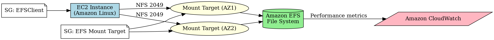

# Hosting a Dynamic Website for a Coffeshop

## Overview
This project describes the process of the coffeshop business business evolves from a static S3 website to a **dynamic, EC2-hosted web application** that enables online ordering.  
The project will configure a full LAMP stack on an EC2 instance, integrate with **AWS Secrets Manager** and **MariaDB**, deploy the café application, and replicate the setup to a second AWS Region for production.

---

## Objectives
The project is able to :

- Connect to AWS **Cloud9 IDE** running on an EC2 instance, and configure the **LAMP stack** (Linux, Apache, MariaDB, PHP)  
- Install and configure the café web application using **Secrets Manager**  
- Test functionality (menu display, order placement, order history)  
- Create an **Amazon Machine Image (AMI)** from the dev environment  
- Deploy a **production environment** in another AWS Region  

---

## Architecture

**Initial State (provided when lab starts):**
- One EC2 instance in **us-east-1 (N. Virginia)** with Cloud9 IDE
- VPC with public subnet
- No web application installed yet

**Final State:**
- **Dev Environment** in us-east-1 (Cloud9 IDE + café app + MariaDB + Secrets Manager)
- **Prod Environment** in us-west-2 (AMI-launched instance + café app + MariaDB + Secrets Manager)
- Both accessible to café customers over the internet

### Diagram

