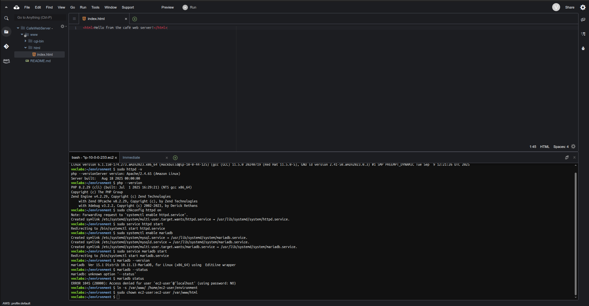

# 01 — Connect to Cloud9 IDE and Configure LAMP Stack

## Goal
Access the Cloud9 IDE on the EC2 instance and configure the LAMP stack (Linux, Apache, MariaDB, PHP).

## Steps
1. Connect to Cloud9 IDE
2. Check versions:
```bash
cat /proc/version
sudo httpd -v
php --version
```
3. Enable and start services:
```bash
sudo chkconfig httpd on
sudo service httpd start
sudo systemctl enable mariadb
sudo service mariadb start
```
4. Link /var/www/html to Cloud9 workspace:
```bash
ln -s /var/www/ /home/ec2-user/environment
sudo chown ec2-user:ec2-user /var/www/html
```
5. Create test file and save as /var/www/html/index.html
<html>Hello from the café web server!</html>

## Notes 
- LAMP stack is required for hosting dynamic PHP web applications.

## Screenshot


