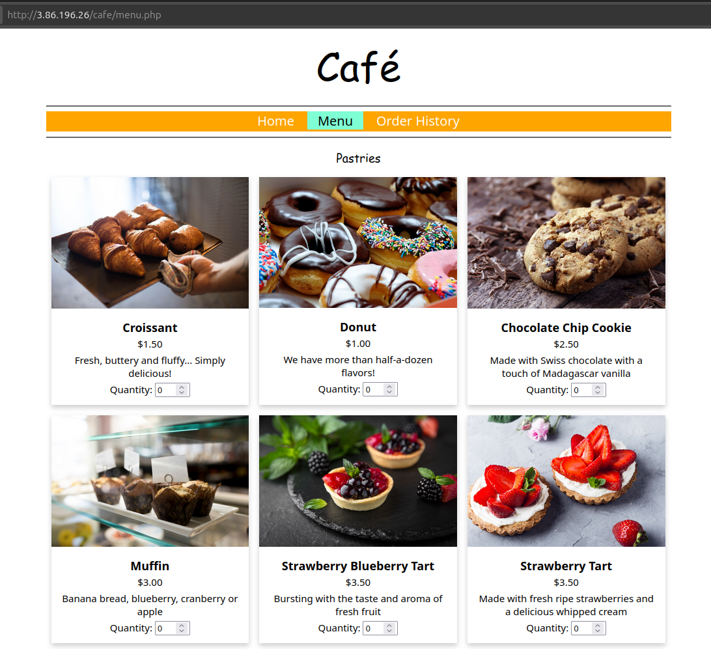
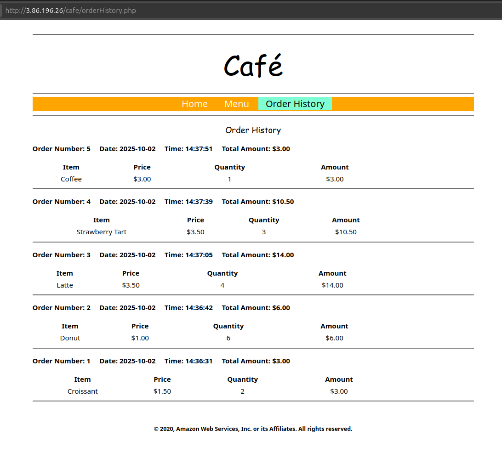

# 03 — Test the App Functionality

## Goal
Verify the app is fully functional: web server, menu display, order placement, and order history.

## Steps
1. Open the test pages:
   - `http://<public-ip>/`
   - `http://<public-ip>/cafe`
2. Test:
   - Page loads from index.html
   - Menu displays café items
   - Place an order → order is saved
   - View **Order History** → previously placed orders visible
3. If issues:
   - check Apache:
```bash
service httpd status
```
   - Check MariaDB:
```bash
service mariadb status
```
   - Check PHP logs in /var/log/httpd/.

## Notes 
- Successful test proves integration between PHP app, database, and Secrets Manager.

## Screenshot



